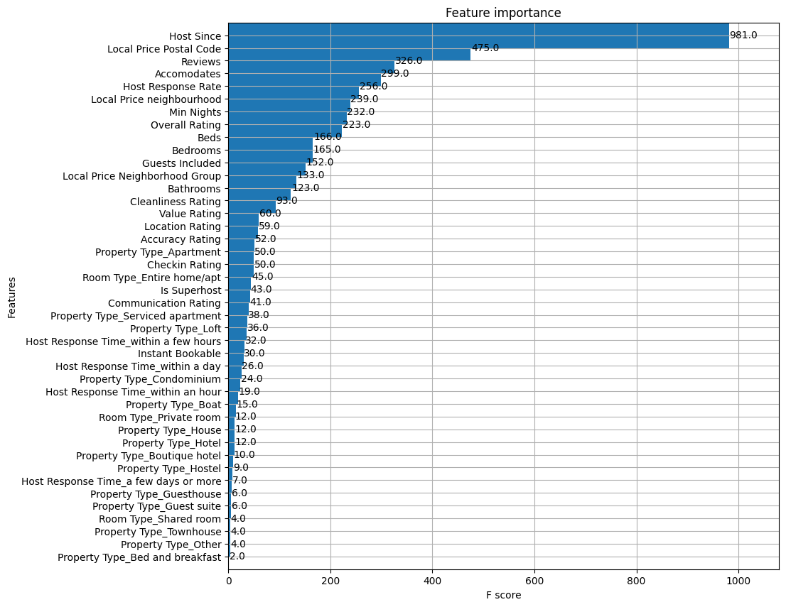

# **Course Project: Airbnb Berlin Price Prediction**

The project aims to predict the price of a night's accommodation offered on the short-term rental website Airbnb in the city of Berlin. This project is derived from a data challenge proposed by dphi.tech.

  

## **Strategy**

Current strategy will be **XGB** because:
- During tabular competitions, XGB generally performed better than other models (e.g. CatBoost, RandomForest, etc.)
- I won't have to deal with feature scaling
- I won't have to deal with missing values
- I won't have to pay attention to multicollinearity
- I will have some understanding of feature importance

  

## **Benchmark**

On a train-test split, using a constant model using the average training price:
- **Average absolute test error of 30.50€**

## **Current Performance**

On a train-test split, using XGB with default parameters and the preprocessing pipeline described below:
- **Average absolute test error of 21.60€**
- **Improves the benchmark by 29%**

## **Performance Log**

| Date | Model | Test Error | Improvement | Comment |
| --- | --- | --- | --- | --- |
| 18-10-2022 | Benchmark | 30.50€ | NA | Constant, average price of training set |
| 18-10-2022 | XGB | 21.60€ | 29% | Default parameters, preprocessing pipeline, overfitting |
  
## **ToDo**

- Cross-validation
- Better Feature Engineering
- Parameter Tuning
- Testing other models

## **Preprocessing Guidelines**

Here is the current preprocessing strategy:

| Feature | Keep? | Description | Modification | Comment |
|---|---|---|---|---|
| Listing ID | :x: | Unique id of the listing |   |  Might be needed to associate data with prediction |
| Listing Name | :x: | This is the name of the listing, this is anonymized in the dataset and you can feel free to drop this variable from the data |  |  |
| Host ID | :x: | Unique ID of the listing host |  |  |
| Host Name | :x: | Name of the host who manages/owns the listing |  |  |
| Host Since | :heavy_check_mark: | Date since they have been hosting on Airbnb | convert to numeric - duration to now |  |
| Host Response Time | :heavy_check_mark: | Avg time taken by the host to respond to any query they get | Convert to one hot | many NaN |
| Host Response Rate | :heavy_check_mark: | Avg response rate to the queries that the host receives for their listing | Convert to numeric | many NaN |
| Is Superhost | :heavy_check_mark: | This field says whether the host is superhost or not. Superhost implies the best-rated host badge given by Airbnb based on the overall listing experience | Convert to bool (currently is "f" or "t") |  |
| neighbourhood | :heavy_check_mark: | Provides information about neighbourhood of the listing | Extract average price and maybe convert to one-hot |  |
| Neighborhood Group | :heavy_check_mark: | Provides information about neighbourhood group of the listing | Extract average price and maybe convert to one-hot |  |
| City | :x: |  |  | Everything is in Berlin |
| Postal Code | :heavy_check_mark: |  | Extract average price and maybe convert to one-hot |  |
| Country Code | :x: |  |  | Everything is in Germany |
| Country | :x: |  | Everything is in Germany |  |
| Latitude | :interrobang: |  |  | Could be useful but doubt |
| Longitude | :interrobang: |  |  | Could be useful but doubt |
| Is Exact Location | :interrobang: |  |  | Doesn't look like useful |
| Property Type | :heavy_check_mark: |  | Convert to one hot |  |
| Room Type | :heavy_check_mark: |  | Convert to one hot |  |
| Accomodates | :heavy_check_mark: |  | Convert to numeric |  |
| Bathrooms | :heavy_check_mark: |  | Convert to numeric |  |
| Bedrooms | :heavy_check_mark: |  | Convert to numeric |  |
| Beds | :heavy_check_mark: |  | Convert to numeric |  |
| Square Feet | :x: |  |  | Too many NaN |
| Guests Included | :heavy_check_mark: |  | Convert to numeric |  |
| Min Nights | :heavy_check_mark: |  | Convert to numeric |  |
| Reviews | :heavy_check_mark: |  | Convert to numeric |  |
| First Review | :interrobang: |  |  |  |
| Last Review | :interrobang: |  |  | Could be useful as recent reviews are generally more relevant |
| Overall Rating | :heavy_check_mark: |  | Convert to numeric |  |
| Accuracy Rating | :heavy_check_mark: |  | Convert to numeric |  |
| Cleanliness Rating | :heavy_check_mark: |  | Convert to numeric |  |
| Checkin Rating | :heavy_check_mark: |  | Convert to numeric |  |
| Communication Rating | :heavy_check_mark: |  | Convert to numeric |  |
| Location Rating | :heavy_check_mark: |  | Convert to numeric |  |
| Value Rating | :heavy_check_mark: |  | Convert to numeric |  |
| Instant Bookable | :heavy_check_mark: |  | Convert to bool (currently is "f" or "t") |  |
| Business Travel Ready | :heavy_check_mark: |  | Convert to bool (currently is "f" or "t") |  |
| **Price** | :white_check_mark: | **TARGET** | Convert to numeric |  |

Current feature importance is as follows:

  

## **Original Guidelines**

The project guidelines are:

- Apply all approaches taught in the course and practiced in lab sessions (Decision Trees, Bagging, Random forests, Boosting, Gradient Boosted Trees, AdaBoost, etc.) on this data set. The goal is to predict the target variable (price). You can try more advanced approaches if you think that they are adequate. If you do that, please justify the adequation.
- Compare the performances of all these models (in terms of the adequate accuracy metrics you can output). 
- Conclude the most appropriate approach to this data set for the predictive task. 
- Write a report and send it in .pdf format that addresses all these guidelines with a maximum page number of 5 (including figures, tables, and references). We will consider the quality of the writing and presentation of the report.