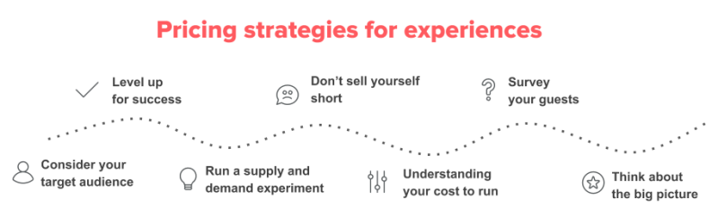

# **Airbnb Berlin Price Prediction**

The project aims to predict the price of a night's accommodation offered on the short-term rental website Airbnb in the city of Berlin. This project is derived from a data challenge proposed by dphi.tech.

  

## **Table of Contents**
  - [**Problem Statement**](#problem-statement)
    - [**Important Note**](#important-note)
  - [**Strategy**](#strategy)
  - [**Baseline**](#baseline)
  - [**Current Performance**](#current-performance)
  - [**Performance Log**](#performance-log)
  - [**Preprocessing Guidelines**](#preprocessing-guidelines)
    - [**Preprocessing Strategy**](#preprocessing-strategy)
    - [**Feature importance**](#feature-importance)

## **Problem Statement**

The goal here is to predict the price of an Airbnb rental in Berlin using features of the listing such as location, number of bedrooms, reviews...

### **Important Note**
The metric used in this challenge ( RMSE between predicted and actual price ) makes no sense. It measures if the price is close to what other users have proposed which is not optimal.

If the goal was really to build a price predictor for Airbnb, **the metric should measure what price maximises the profit/marketing** of the listing.

A strategy for this goal in mind could be to build a simple decision tree based on marketing guidelines e.g:
- Start with average price for this neighbourhood and number of bedrooms
- If not enough reviews, underprice listing to get more sales
- ...

  

We will use error metrics for this challenge but keep in mind that it is not the best metric for this problem.

## **Strategy**

Current strategy will be **XGB** because of:
- **Performance:**
  - In my experience, in tabular competitions, XGB generally performed better than other models (e.g. RandomForest)
- **Ease of use:**
  - no need for feature scaling
  - no need to deal with missing values
  - no need to pay attention to multicollinearity
  - plots feature importance

  

## **Baseline**

On a train-test split, using a constant model using the average training price:
- **Average absolute test error of 30.50€**
- **Percentage of predictions within 20€ of the true price: 39%** ( average price is 61€ )

## **Current Performance**

On a train-test split, using XGB with default parameters and the preprocessing pipeline described below:
- **Average absolute test error of 20.60€**
- **Percentage of predictions within 20€ of the true price: 70%**

## **Performance Log**

| Date | Model | Test Error | Improvement | Comment |
| --- | --- | --- | --- | --- |
| 18-10-2022 | Baseline | 30.50€ | NA | Constant, average price of training set |
| 18-10-2022 | XGB | 21.60€ | 29% | Default parameters, preprocessing pipeline, overfitting |
| 19-10-2022 | XGB | 20.60€ | 4% | Hyperparameter Tuning |
| 19-10-2022 | XGB | 20.50€ | 0.4% | Adds Local Geographic Price using 30 nearest neighbours |

## **Preprocessing Guidelines**

### **Preprocessing Strategy**

| Feature | Keep? | Description | Modification | Comment |
|---|---|---|---|---|
| Listing ID | :x: | Unique id of the listing |   |  Might be needed to associate data with prediction |
| Listing Name | :x: | This is the name of the listing, this is anonymized in the dataset and you can feel free to drop this variable from the data |  |  |
| Host ID | :x: | Unique ID of the listing host |  |  |
| Host Name | :x: | Name of the host who manages/owns the listing |  |  |
| Host Since | :heavy_check_mark: | Date since they have been hosting on Airbnb | convert to numeric - duration to now |  |
| Host Response Time | :heavy_check_mark: | Avg time taken by the host to respond to any query they get | Convert to one hot | many NaN |
| Host Response Rate | :heavy_check_mark: | Avg response rate to the queries that the host receives for their listing | Convert to numeric | many NaN |
| Is Superhost | :heavy_check_mark: | This field says whether the host is superhost or not. Superhost implies the best-rated host badge given by Airbnb based on the overall listing experience | Convert to bool (currently is "f" or "t") |  |
| neighbourhood | :heavy_check_mark: | Provides information about neighbourhood of the listing | Extract average price and maybe convert to one-hot |  |
| Neighborhood Group | :heavy_check_mark: | Provides information about neighbourhood group of the listing | Extract average price and maybe convert to one-hot |  |
| City | :x: |  |  | Everything is in Berlin |
| Postal Code | :heavy_check_mark: |  | Extract average price and maybe convert to one-hot |  |
| Country Code | :x: |  |  | Everything is in Germany |
| Country | :x: |  | Everything is in Germany |  |
| Latitude | :interrobang: |  |  | Could be useful but doubt |
| Longitude | :interrobang: |  |  | Could be useful but doubt |
| Is Exact Location | :interrobang: |  |  | Doesn't look like useful |
| Property Type | :heavy_check_mark: |  | Convert to one hot |  |
| Room Type | :heavy_check_mark: |  | Convert to one hot |  |
| Accomodates | :heavy_check_mark: |  | Convert to numeric |  |
| Bathrooms | :heavy_check_mark: |  | Convert to numeric |  |
| Bedrooms | :heavy_check_mark: |  | Convert to numeric |  |
| Beds | :heavy_check_mark: |  | Convert to numeric |  |
| Square Feet | :x: |  |  | Too many NaN |
| Guests Included | :heavy_check_mark: |  | Convert to numeric |  |
| Min Nights | :heavy_check_mark: |  | Convert to numeric |  |
| Reviews | :heavy_check_mark: |  | Convert to numeric |  |
| First Review | :interrobang: |  |  |  |
| Last Review | :interrobang: |  |  | Could be useful as recent reviews are generally more relevant |
| Overall Rating | :heavy_check_mark: |  | Convert to numeric |  |
| Accuracy Rating | :heavy_check_mark: |  | Convert to numeric |  |
| Cleanliness Rating | :heavy_check_mark: |  | Convert to numeric |  |
| Checkin Rating | :heavy_check_mark: |  | Convert to numeric |  |
| Communication Rating | :heavy_check_mark: |  | Convert to numeric |  |
| Location Rating | :heavy_check_mark: |  | Convert to numeric |  |
| Value Rating | :heavy_check_mark: |  | Convert to numeric |  |
| Instant Bookable | :heavy_check_mark: |  | Convert to bool (currently is "f" or "t") |  |
| Business Travel Ready | :heavy_check_mark: |  | Convert to bool (currently is "f" or "t") |  |
| **Price** | :white_check_mark: | **TARGET** | Convert to numeric |  |

### **Feature importance**

  

